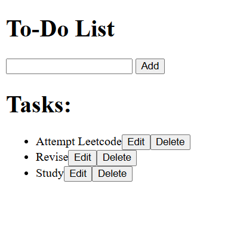
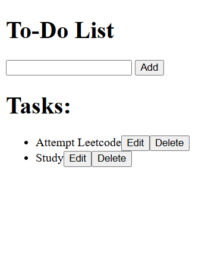
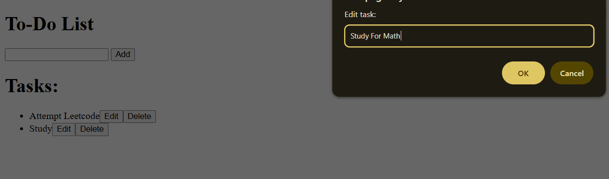

# A2SV WEB TRACK - To-Do List With JavaScript📝

Let's learn JS. This is the first step to learning the awesome JavaScript language.

## Introduction

In this task a simple To-Do list is created. It implements 3 Buttons ; Add, Edit and Delete.

## Learning Objectives :bookmark_tabs:

* How does JavaScript Work
* How to use JavaScript with HTML
* JavaScript functions

## Tasks :heavy_check_mark:

0. Create text input.
1. Implement Add button.
2. Implement Remove button.
3. Implement Edit Button.
4. Implement Edit functionality.
5. Input error handling.

## Results :chart_with_upwards_trend:

| Filename |
| ------ |
| [html](https://github.com/omphilejmatsobe/to-do-js/blob/master/index.html)|
| [javascript](https://github.com/omphilejmatsobe/to-do-js/blob/master/index.html)|

## ScreenShots :bookmark_tabs:

## Add:

## Delete:

## Edit:

>

## Error:

